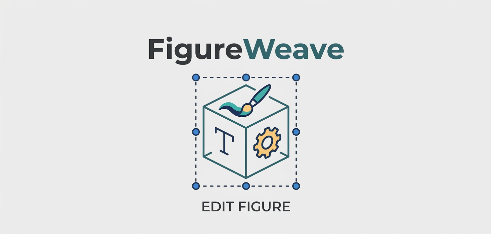
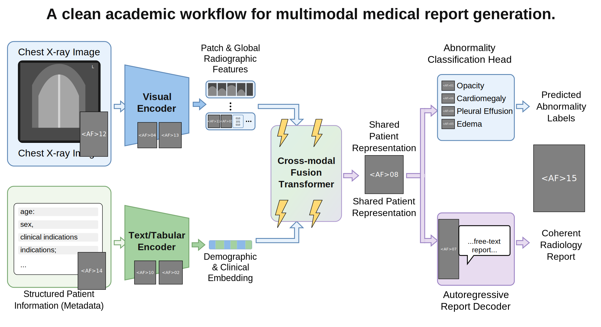
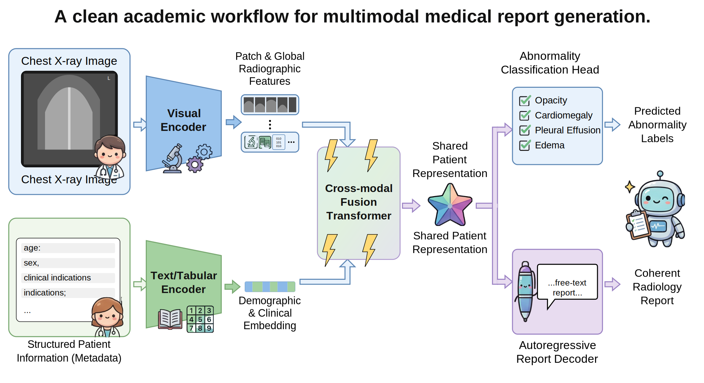
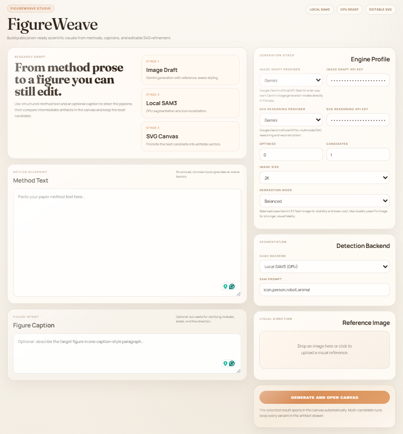

<div align="center">

<p align="center">
  
</p>

**From method text to editable scientific figures**

<p align="center">
  <a href="requirements.txt">
    
  </a>
  <a href="LICENSE">
    
  </a>
  <a href="#local-sam3">
    
  </a>
  <a href="#local-sam3">
    
  </a>
</p>

<p align="center">
  <a href="https://ai.google.dev/gemini-api/docs" target="_blank" rel="noopener noreferrer">
    
  </a>
  <a href="https://platform.openai.com/docs/overview" target="_blank" rel="noopener noreferrer">
    
  </a>
  <a href="https://docs.anthropic.com/" target="_blank" rel="noopener noreferrer">
    
  </a>
</p>

[English](README.md) | [中文](README_ZH.md)

</div>

---

##  Overview

FigureWeave is a research-engineering project for turning paper method descriptions into publication-style figures that remain editable as SVG.

This project is **inspired by AutoFigure**, but it is no longer a mirror of the original system. The current codebase has been reworked into a more practical figure authoring pipeline with:

- local GPU SAM3 segmentation
- split routing for image drafting and SVG reasoning
- multi-candidate end-to-end generation
- figure caption conditioning in addition to method text
- SVG-first reconstruction with template, optimized template, and final assembly stages
- CUDA-accelerated local post-processing for segmentation and background removal

FigureWeave is especially useful for:

- method overviews
- pipeline diagrams
- system schematics
- architecture figures
- editable draft figures for papers, slides, and reports

It is **not** intended to replace precise plotting tools such as matplotlib, seaborn, ggplot, or Origin for charts driven by exact numeric data.

---

##  Code Layout

The project is no longer organized as one large monolithic script.

- [`figureweave.py`](figureweave.py) is now a thin compatibility entrypoint for CLI execution and top-level imports.
- [`src/figureweave/config.py`](src/figureweave/config.py) stores provider defaults, paths, and shared constants.
- [`src/figureweave/llm.py`](src/figureweave/llm.py) contains Gemini, OpenAI, Claude, OpenRouter, and related model-calling logic.
- [`src/figureweave/vision.py`](src/figureweave/vision.py) covers image drafting, SAM3 segmentation, and background removal.
- [`src/figureweave/svg_ops.py`](src/figureweave/svg_ops.py) handles SVG reconstruction, repair, optimization, and asset replacement.
- [`src/figureweave/pipeline.py`](src/figureweave/pipeline.py) orchestrates the end-to-end pipeline and multi-candidate execution.
- [`src/figureweave/cli.py`](src/figureweave/cli.py) defines the command-line interface.

This split makes the codebase easier to extend, debug, and test without changing the public CLI usage.

---

##  What Is New In FigureWeave

Compared with the original AutoFigure-style workflow, this project adds several concrete contributions:

1. **Local SAM3 on GPU**
   Segmentation can run locally on CUDA instead of depending only on hosted APIs. This improves speed, privacy, and reproducibility for the icon-region extraction stage.

2. **Dual-provider model routing**
   Image drafting and SVG reasoning are now decoupled, so the pipeline can use different providers for different stages, such as `Gemini -> Gemini`, `OpenAI -> OpenAI`, `Gemini -> Anthropic Claude`, or `OpenAI -> Anthropic Claude`.

3. **Multi-candidate generation**
   A single run can generate multiple full candidates, preserve each artifact bundle, write a candidate manifest, and promote a selected result as the default output.

4. **Figure caption conditioning**
   The system accepts both method text and a figure caption / figure brief, so the generator and reconstructor can be constrained by explicit stage structure, layout intent, and narrative emphasis.

5. **SVG-first reconstruction pipeline**
   Instead of treating the raster image as the final result, FigureWeave explicitly reconstructs an editable SVG template, optionally refines that template, and only then assembles the final SVG with extracted assets.

6. **CUDA-accelerated local post-processing**
   Background removal and other local visual post-processing stages now use GPU-capable PyTorch when available, reducing the CPU bottleneck of the original workflow.

7. **More robust fallback behavior**
   The current pipeline includes explicit fallback paths for no-icon cases, placeholder reduction, and provider-side failures, which makes batch generation more practical for real paper figure drafting.

---

##  Gallery: Editable Vectorization & Style Transfer

The following assets are used as the current FigureWeave showcase from the `multimodal_medical_report` run:

1. Draft image: [img/case/multimodal_medical_report_draft.png](img/case/multimodal_medical_report_draft.png)
2. Optimized SVG template: [img/case/multimodal_medical_report_template.svg](img/case/multimodal_medical_report_template.svg)
3. Final assembled SVG: [img/case/multimodal_medical_report_final.svg](img/case/multimodal_medical_report_final.svg)

<p align="center">
  
  
  
</p>

This showcase highlights the intended FigureWeave workflow:

- `figure.png` as the model-generated draft
- `optimized_template.svg` as the editable structural reconstruction
- `final.svg` as the assembled showcase result

---

##  UI Preview

The browser-based FigureWeave interface for configuring providers, reviewing artifacts, and launching editable figure generation:

1. UI snapshot: [img/UI/UI.png](img/UI/UI.png)
2. Promo artwork: [img/UI/FigureWeave.jpg](img/UI/FigureWeave.jpg)

<p align="center">
  
</p>

---

##  How It Works

FigureWeave currently runs in five major stages:

1. **Image Draft**
   Generate a scientific-style draft figure from method text, optional figure caption, and optional reference image.

2. **Segmentation**
   Run local SAM3 or an API backend to detect icons and visual regions, producing:
   - `samed.png`
   - `boxlib.json`

3. **Asset Extraction**
   Crop detected regions and remove backgrounds to create transparent assets.

4. **SVG Reasoning And Reconstruction**
   Use a multimodal model to reconstruct the draft into an editable SVG template, then optionally refine it.

5. **Assembly**
   Replace placeholders with extracted assets and emit:
   - `template.svg`
   - `optimized_template.svg`
   - `final.svg`

---

##  Configuration

### Provider Labels

<p>
  
  
  
</p>

### Image Draft Provider

- `Gemini`
- `OpenAI`

### SVG Reasoning And Reconstruction Provider

- `Gemini`
- `OpenAI`
- `Anthropic Claude`

### Practical Note

Anthropic Claude is used here for **understanding and reconstruction**, not for native image generation. In this project, the image drafting stage should use Gemini or OpenAI.

###  Web Interface

Start the server:

```bash
python server.py
```

Then open:

```text
http://127.0.0.1:8000
```

The main configuration page now includes:

- `Method Text`
- `Figure Caption`
- `Image Draft Provider`
- `SVG Reasoning Provider`
- `Candidates`
- `Generation Mode`
- `SAM3 Backend`
- `Reference Image`

The canvas page lets you:

- inspect intermediate artifacts
- switch between candidate SVGs
- review logs
- open the result in the embedded SVG editor

---

##  Quick Start

### Basic

```bash
python figureweave.py   --method_file paper.txt   --output_dir outputs/demo   --image_provider gemini   --image_api_key YOUR_GEMINI_KEY   --svg_provider anthropic   --svg_api_key YOUR_ANTHROPIC_KEY
```

### Single-Provider Fallback

If you want to use one provider for both stages, you can still use:

```bash
python figureweave.py   --method_file paper.txt   --output_dir outputs/demo   --provider gemini   --api_key YOUR_GEMINI_KEY
```

### Multi-Candidate Generation

```bash
python figureweave.py   --method_file paper.txt   --output_dir outputs/demo_multi   --image_provider gemini   --image_api_key YOUR_GEMINI_KEY   --svg_provider openai   --svg_api_key YOUR_OPENAI_KEY   --num_candidates 3
```

---

<a id="local-sam3"></a>

##  Local SAM3

FigureWeave supports local SAM3 execution on GPU.

Typical setup:

```bash
git clone https://github.com/facebookresearch/sam3.git
cd sam3
pip install -e .
```

You also need:

- an available NVIDIA GPU
- CUDA-enabled PyTorch in the current environment
- Hugging Face access to SAM3

If local SAM3 is unavailable, the codebase can still fall back to other segmentation paths depending on your configuration.

---

##  Installation

###  Python Environment

```bash
pip install -r requirements.txt
```

###  Environment Variables

At minimum, you will usually want:

```env
HF_TOKEN=your_huggingface_token
ROBOFLOW_API_KEY=your_roboflow_key
```

Depending on your selected routing, you may also need:

- Gemini API key
- OpenAI API key
- Anthropic API key

---

##  Docker

Build and run:

```bash
docker compose up -d --build
```

Health checks:

```bash
docker compose ps
curl http://127.0.0.1:8000/healthz
```

Logs:

```bash
docker compose logs -f figureweave
```

Restart:

```bash
docker compose restart figureweave
```

---

##  Output Structure

Typical outputs include:

- `figure.png`
- `samed.png`
- `boxlib.json`
- `icons/`
- `template.svg`
- `optimized_template.svg`
- `final.svg`
- `candidates_manifest.json`

When multi-candidate mode is enabled, each run is stored under:

- `candidate_01/`
- `candidate_02/`
- `candidate_03/`

---

##  Credits

FigureWeave is **inspired by AutoFigure** and builds on the broader idea of converting scientific method descriptions into figure drafts.

The current project extends that direction with:

- local GPU segmentation
- dual-provider routing
- multi-candidate generation
- in-browser SVG refinement
- a more complete engineering workflow

---

##  License

This repository is released under the MIT License in [`LICENSE`](LICENSE).
