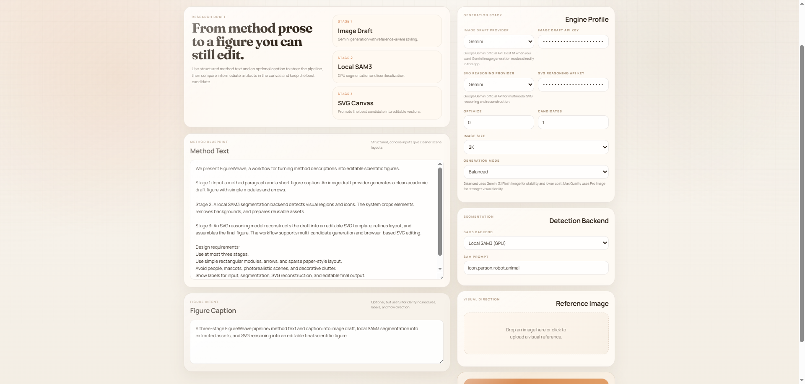
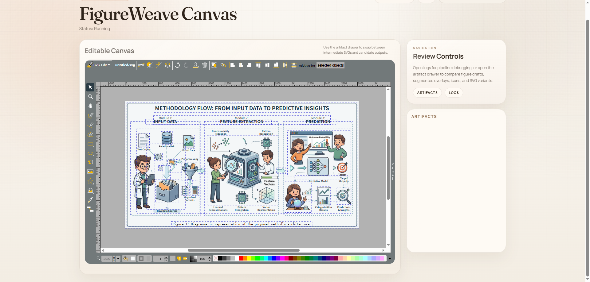

<div align="center">

<p align="center">
  
</p>

**从方法文本到可编辑科研插图**

<p align="center">
  <a href="requirements.txt">
    
  </a>
  <a href="LICENSE">
    
  </a>
  <a href="#local-sam3">
    
  </a>
  <a href="#local-sam3">
    
  </a>
</p>

<p align="center">
  <a href="https://ai.google.dev/gemini-api/docs" target="_blank" rel="noopener noreferrer">
    
  </a>
  <a href="https://platform.openai.com/docs/overview" target="_blank" rel="noopener noreferrer">
    
  </a>
  <a href="https://docs.anthropic.com/" target="_blank" rel="noopener noreferrer">
    
  </a>
</p>

[English](README.md) | [中文](README_ZH.md)

</div>

---

##  项目概览

FigureWeave 是一个面向科研绘图的研究工程项目，用于将论文中的方法描述自动转化为可编辑的 SVG 科研图。

本项目**受 AutoFigure 启发**，但现在已经不再是原项目的简单延续或镜像版本。当前代码库更加聚焦可编辑性、可部署性和完整工作流，核心技术更新包括：

- 本地 GPU SAM3 分割
- 生图阶段与 SVG 推理阶段解耦的双 provider 路由
- 多候选端到端生成
- 在方法文本之外引入 figure caption 作为结构约束
- 以 SVG 重建为中心的 `template -> optimized_template -> final` 流程
- 基于 CUDA 的本地后处理与去背景加速

FigureWeave 更适合以下图形：

- 方法总览图
- pipeline 图
- 系统框架图
- 模型结构图
- 可继续人工润色的论文插图草稿

它**不适合**替代 matplotlib、seaborn、ggplot、Origin 这类以精确数值为核心的统计绘图工具。

---

##  FigureWeave 的技术亮点

相较于 AutoFigure 风格的原始流程，FigureWeave 当前版本的主要技术贡献包括：

1. **本地 GPU SAM3**
   分割阶段可以直接在本地 CUDA 环境中运行，不再只依赖远程 API，从而提升隐私性、可控性和复现实验的稳定性。

2. **双 provider 路由**
   将图像草图生成与 SVG 理解/重建拆分为两个独立阶段，可灵活组合 `Gemini -> Gemini`、`OpenAI -> OpenAI`、`Gemini -> Anthropic Claude`、`OpenAI -> Anthropic Claude` 等路线。

3. **多候选生成**
   一次运行可以生成多个完整候选，分别保留各自的中间产物，并通过 manifest 管理候选结果与默认产出。

4. **Figure Caption 条件约束**
   除方法文本外，系统还显式接收图注或绘图意图，从而在布局结构、阶段划分和信息重点上提供更强约束。

5. **SVG-first 重建流程**
   系统不会把 raster 草图当作最终结果，而是显式生成可编辑 SVG 模板、可选优化模板，再进行最终组装，强调后续可编辑性。

6. **CUDA 本地后处理**
   去背景与本地视觉后处理可使用 GPU 版 PyTorch 执行，减少 CPU-only 模式下的耗时瓶颈。

7. **更稳健的回退策略**
   当前流程包含 no-icon fallback、占位框裁剪、provider 失败回退等机制，更适合实际批量生成论文插图草稿。

---

##  展示图：可编辑向量化与风格迁移

当前项目展示图使用 `multimodal_medical_report` 这一组结果：

1. 草图：[`img/case/multimodal_medical_report_draft.png`](img/case/multimodal_medical_report_draft.png)
2. 优化后的 SVG 模板：[`img/case/multimodal_medical_report_template.svg`](img/case/multimodal_medical_report_template.svg)
3. 最终组装 SVG：[`img/case/multimodal_medical_report_final.svg`](img/case/multimodal_medical_report_final.svg)

<p align="center">
  
  
  
</p>

这组展示图对应的含义是：

- `figure.png`：模型生成的草图
- `optimized_template.svg`：可编辑结构模板
- `final.svg`：最终组装后的展示结果

---

##  ????

?????? FigureWeave ????????? SVG ?????

1. ?????[`img/UI/UI_1.png`](img/UI/UI_1.png)
2. ??????[`img/UI/UI_2.png`](img/UI/UI_2.png)

<p align="center">
  
</p>

<p align="center">
  
</p>

---

##  工作原理

FigureWeave 当前主要包含五个阶段：

1. **Image Draft**
   根据方法文本、可选 figure caption 和可选参考图生成科研风格草图。

2. **Segmentation**
   使用本地 SAM3 或 API 后端检测图标与视觉区域，输出：
   - `samed.png`
   - `boxlib.json`

3. **Asset Extraction**
   裁切检测区域并去除背景，生成透明素材。

4. **SVG Reasoning And Reconstruction**
   使用多模态模型将草图重建为可编辑 SVG 模板，并可进一步优化。

5. **Assembly**
   将素材替换回 SVG 占位结构，输出：
   - `template.svg`
   - `optimized_template.svg`
   - `final.svg`

---

##  配置说明

### Provider 标签

<p>
  
  
  
</p>

### 生图阶段 Provider

- `Gemini`
- `OpenAI`

### SVG 理解与重建 Provider

- `Gemini`
- `OpenAI`
- `Anthropic Claude`

### 说明

Anthropic Claude 在本项目中用于**理解与重建**，而不是原生生图。因此，图像草图生成阶段应使用 Gemini 或 OpenAI。

###  Web 界面

启动服务：

```bash
python server.py
```

然后打开：

```text
http://127.0.0.1:8000
```

首页当前支持的主要输入项包括：

- `Method Text`
- `Figure Caption`
- `Image Draft Provider`
- `SVG Reasoning Provider`
- `Candidates`
- `Generation Mode`
- `SAM3 Backend`
- `Reference Image`

画布页支持：

- 查看中间产物
- 切换候选 SVG
- 查看日志
- 在嵌入式 SVG 编辑器中继续修改结果

---

##  快速开始

### 基础示例

```bash
python figureweave.py \
  --method_file paper.txt \
  --output_dir outputs/demo \
  --image_provider gemini \
  --image_api_key YOUR_GEMINI_KEY \
  --svg_provider anthropic \
  --svg_api_key YOUR_ANTHROPIC_KEY
```

### 单 provider 兼容模式

如果你希望两个阶段都使用同一个 provider，也可以使用：

```bash
python figureweave.py \
  --method_file paper.txt \
  --output_dir outputs/demo \
  --provider gemini \
  --api_key YOUR_GEMINI_KEY
```

### 多候选生成

```bash
python figureweave.py \
  --method_file paper.txt \
  --output_dir outputs/demo_multi \
  --image_provider gemini \
  --image_api_key YOUR_GEMINI_KEY \
  --svg_provider openai \
  --svg_api_key YOUR_OPENAI_KEY \
  --num_candidates 3
```

---

##  本地 SAM3

FigureWeave 支持在 GPU 上本地部署并运行 SAM3。

典型安装方式：

```bash
git clone https://github.com/facebookresearch/sam3.git
cd sam3
pip install -e .
```

你还需要：

- 可用的 NVIDIA GPU
- 当前环境中安装 CUDA 版 PyTorch
- 在 Hugging Face 上获得 SAM3 权限

如果本地 SAM3 不可用，系统仍可根据当前配置回退到其它分割路径。

---

##  安装

###  Python 环境

```bash
pip install -r requirements.txt
```

###  环境变量

通常至少建议配置：

```env
HF_TOKEN=your_huggingface_token
ROBOFLOW_API_KEY=your_roboflow_key
```

根据你选择的模型路线，还可能需要：

- Gemini API key
- OpenAI API key
- Anthropic API key

---

##  Docker

构建并启动：

```bash
docker compose up -d --build
```

健康检查：

```bash
docker compose ps
curl http://127.0.0.1:8000/healthz
```

查看日志：

```bash
docker compose logs -f figureweave
```

重启服务：

```bash
docker compose restart figureweave
```

---

##  输出结构

典型输出包括：

- `figure.png`
- `samed.png`
- `boxlib.json`
- `icons/`
- `template.svg`
- `optimized_template.svg`
- `final.svg`
- `candidates_manifest.json`

启用多候选后，每个候选通常位于：

- `candidate_01/`
- `candidate_02/`
- `candidate_03/`

---

##  致谢

FigureWeave **受 AutoFigure 启发**，继承了“从科研方法文本生成插图草图”这一总体方向。

在此基础上，本项目进一步强化了以下方面：

- 本地 GPU 分割能力
- 双 provider 路由设计
- 多候选生成
- 浏览器内 SVG 精修
- 更完整的工程工作流

---

##  许可证

本仓库当前沿用现有的 [`LICENSE`](LICENSE)。
